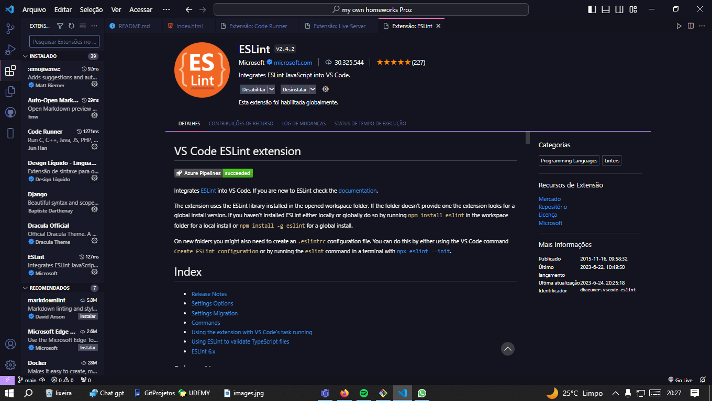

ESlint javascript

O ESLint é uma ferramenta de linting para JavaScript que auxilia os desenvolvedores a identificar e corrigir erros de sintaxe, estilo e boas práticas de programação no código-fonte.
Ao escrever código JavaScript, é comum cometer erros, como esquecer um ponto e vírgula, usar variáveis não declaradas ou adotar um estilo inconsistente. Esses erros podem levar a bugs ou dificultar a leitura e manutenção do código.O ESlint JS  analisa seu código JavaScript em busca de possíveis problemas e fornece mensagens de erro ou aviso para indicar onde estão esses problemas.